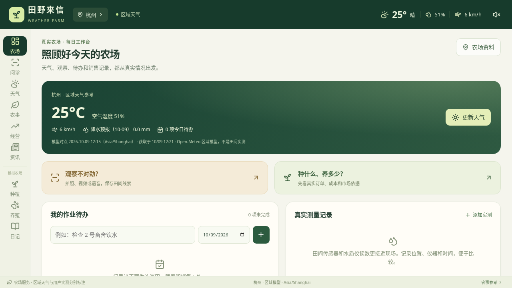
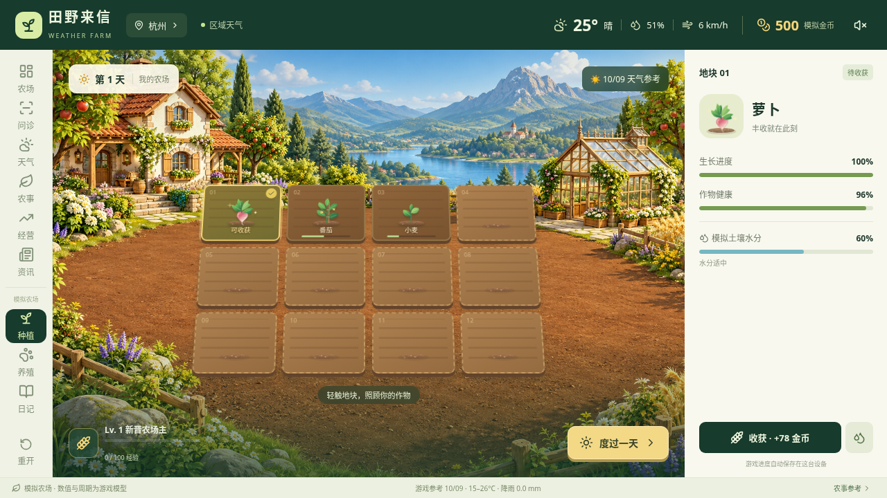
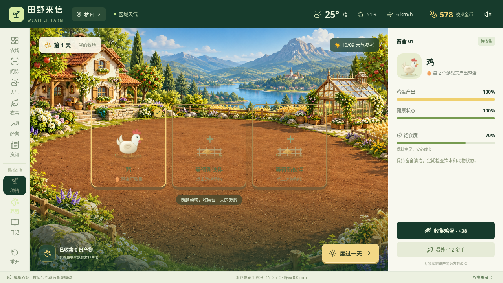

# 田野来信 · Weather Farm

为农场主服务的中文横屏安卓应用，配有天气驱动的农场模拟游戏。首页面向真实工作：区域天气、巡田巡舍、实测记录、作业待办、田间问诊，以及有官方来源的农业资讯和经营参考。

[下载 Android 试玩版](https://github.com/schlapiadeziel-rgb/weather-farm-mobile/releases/tag/v0.2.0) · [版本与安装包](https://github.com/schlapiadeziel-rgb/weather-farm-mobile/releases)





截图为开发预览。天气与资讯以各自显示的来源、地区和时间为准。

## 真实农场服务

- **天气与检查**：Open-Meteo 区域气温、空气相对湿度、降水、风速和七日预报；显示模型时点、获取时间和缓存状态。高温、低温、降雨和大风触发通用现场检查提醒，可加入真实待办。
- **本机记录**：农场资料、待办与完成状态、带采样位置/时间/仪器的实测记录；包括空气、土壤与养殖水质。支持 JSON 导出和备份合并。
- **田间问诊**：作物和动物名称不限于游戏品种。输入异常、发生时间、数量、阶段与管理变化，可拍照、录制/选择不超过 30 秒的视频，或使用本机离线中文语音转文字。每次最多三张照片或视频关键帧；原视频动作和声音不参与模型推理。
- **本地 AI**：Android ARM64 原生 llama.cpp + libmtmd CPU 推理，Qwen3.5 图文模型。用户选择下载或导入，按固定版本的大小与 SHA-256 校验；模型就绪后图文推理不联网。JSON 语法约束只保证字段结构，内容还需通过风险与措辞校验。浏览器预览没有该引擎。
- **可追溯的问诊记录**：整理观察、可能原因、证据不足、低风险检查及求助条件；独立危险症状规则先提醒。格式错误、用药剂量、确诊和准确率承诺不会变成有效结构化建议。最多保存 20 个本机案例，保留模型版本与耗时；原照片、视频和音轨不写入案例备份。
- **新闻与科普**：读取农业农村部官方列表和原文节选，显示发布日期并链接原文；正文失败不生成摘要。另有标明日期与适用范围的官方季节性指导，以及 FAO、WOAH 等参考资料。
- **经营参考**：农业农村部全国批发均价，保留“元/公斤”、统计范围、报价时点和来源。结合用户核实的当地采购询价、已确认订单及单位成本，提醒交付与销售核查；询价与订单分开，价格上涨不推断需求上涨或自动建议扩产。

## 模型档位与设备

| 模型 | 主模型 + 视觉投影器下载量 | 建议设备内存 | 定位 |
|---|---:|---:|---|
| Qwen3.5 0.8B Q4_K_M | 约 0.74 GB | 6 GB 起 | 轻量兼容；能力有限 |
| Qwen3.5 2B Q4_K_M | 约 1.95 GB | 8 GB 起 | 平衡档 |
| Qwen3.5 4B Q4_K_M | 约 3.41 GB | 12 GB 起 | 高内存可选档，更慢、占用更高 |

首次按设备可见内存推荐档位，用户可以切换。加载时另外检查可用内存；权重之外还需要视觉计算、上下文与系统空间。4B 参数量更大不等于疾病识别准确率已获验证。模型不包含在 APK 中，不会自动下载；首次下载需要网络和足够存储，或分别导入所选档位的主模型和配套 `mmproj-F16.gguf`。应用内提供固定版本来源链接。

安装包仅支持 **ARM64 Android 6.0+**。本机语音需要 **Android 12+、离线语音引擎与已安装的中文语音包**；缺少时明确提示手动输入，不切换云端识别。性能取决于芯片、内存、系统与输入大小；尚未完成安卓真机性能和农学/兽医学专项准确率验证。

## 农场模拟游戏

原创高清场景、随生长阶段变化的矢量作物和动物、轻微动态效果，以及种植/浇水/收获与购买动物/喂养/收集产出的触控循环。支持萝卜、番茄、小麦、草莓，以及鸡、奶牛、绵羊；区域天气影响游戏生长和产出，本机自动存档、日记、音效与原生震动。

游戏金币、周期、健康、土壤水分和收益用于模拟玩法，**不参与真实问诊、实测记录或经营建议**。一个游戏天不等于真实生产一天。重开模拟农场只清除游戏进度。

## 数据、信息与隐私

- Open-Meteo 是区域气象模型产品，不是农田传感器。空气湿度不能代替根区含水率，空气温度不能代替养殖水温。过时或连接失败的数据保留标识，并暂停新的天气作业提醒。
- 本地模型是通用图文模型，未经该应用的农学和兽医学专项验证，没有经过验证的诊断准确率。输出辅助整理线索和排查，不能替代现场检测、农技人员或执业兽医。
- 模型可能不能按要求输出有效 JSON；应用会保留清楚的失败说明和独立检查提示，不将未验证的模型文字包装成确诊结果。
- 官方全国均价不能代替当地同品种、等级的成交价或消费需求；订单与成本准确性取决于用户输入。不存在自动交易、喷药或设备控制。
- 农场资料、案例、实测和游戏存档保存在本机；关闭 Android 自动备份。主动点击导出会打开系统分享选择器，由用户选择接收位置。清除应用数据或卸载会删除记录，请定期导出。
- 照片/视频在本机缩小、生成预览/关键帧；案例仅保存文字及媒体说明。语音使用 Android 明确的 on-device 识别接口。
- 天气查询会将所选坐标发送给 Open-Meteo；官方资讯/行情及模型下载连接各自公开来源。图文推理不上传农场观察和媒体。无需账号、天气密钥，无广告或后台跟踪。

气象数据：[Open-Meteo](https://open-meteo.com/)（[API](https://open-meteo.com/en/docs)、[使用条款与许可](https://open-meteo.com/en/terms)），按 CC BY 4.0 署名。免费 API 的用途及限额遵循服务条款，商业上线前需选择适用方案。新闻与指导内容引用官方短节选并链接原文，各来源内容遵循原有权利与条款。

## 本地开发与构建

要求 Node.js 22+。

```bash
npm ci
npm run dev
npm test
npm run build
```

网页为开发预览，原生图文 AI、相机和离线语音请使用安卓版本。官方 HTML 在网页预览中可能受跨域限制；原生版通过 Capacitor HTTP 读取，不用虚构资讯替代失败。

安卓构建要求 JDK 21、Android SDK 35 / Build Tools 35.0.0、NDK 28.2.13676358、CMake 3.31.6。首次构建需网络，原生引擎依赖按固定 commit 和源码 SHA-256 下载。

```bash
npm run android:sync
cd android
./gradlew assembleDebug --no-daemon --max-workers=2
```

输出 `android/app/build/outputs/apk/debug/app-debug.apk`，已用开发密钥签名，用于试玩，不是应用商店发布包。调试版不同构建的签名可能不同；若旧版提示签名冲突，请先导出可备份的记录，再卸载旧版安装，卸载会清除本机数据。GitHub Actions **Build Android APK** 也可构建；**Publish Android Release** 用版本标签与成功构建 run ID 核对源码，发布 APK、源码 ZIP 和 SHA256SUMS。

## 结构与许可

`src/components/` 为真实服务与游戏视觉，`src/lib/` 为天气、信息解析、实际记录、问诊校验和游戏规则，`android/app/src/main/java/com/fieldletter/farm/ai/` 与 `src/main/cpp/` 为本机媒体、模型管理与 JNI 推理。`tests/` 包括官方页面快照解析、日期/单位/缓存、订单成本、危险症状、真实记录及玩法检查。

本项目原创源码和场景资产使用 MIT。游戏灵感参考 [Khet-Setu](https://github.com/rach-kanc/Khet-Setu) 和 [Atmospheric Harvester](https://github.com/feotro23/Atmospheric-Harvester)，没有复制其代码或资产。

原生引擎基于 [NeoLocalAI-Android](https://github.com/schlapiadeziel-rgb/NeoLocalAI-Android) 固定提交 `cc1ffc71c6d02c26d144fd79cb5fa77cfddb17b8` 的 llama.cpp/ggml/libmtmd，MIT 许可。Qwen3.5 权重及其 GGUF 分发遵循 Apache-2.0，固定版本见 `ModelProfiles.java`。依赖与模型许可证随 APK 打包在 `assets/local-ai-licenses/`，依赖锁定信息见 `android/native-dependencies.json`。
